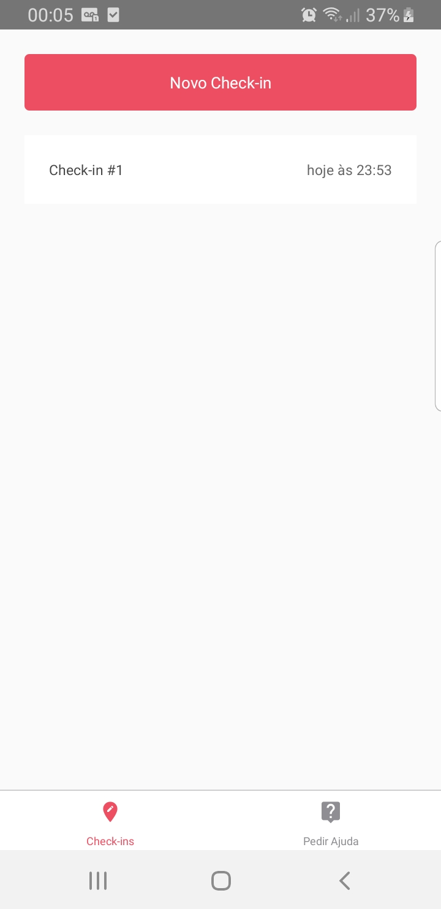
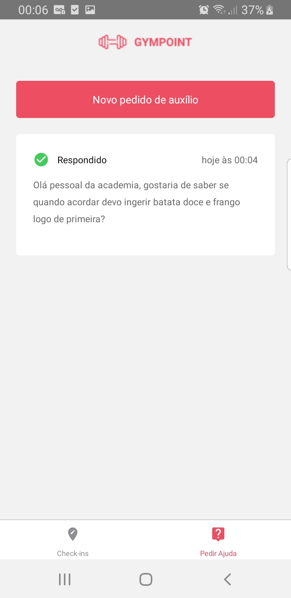
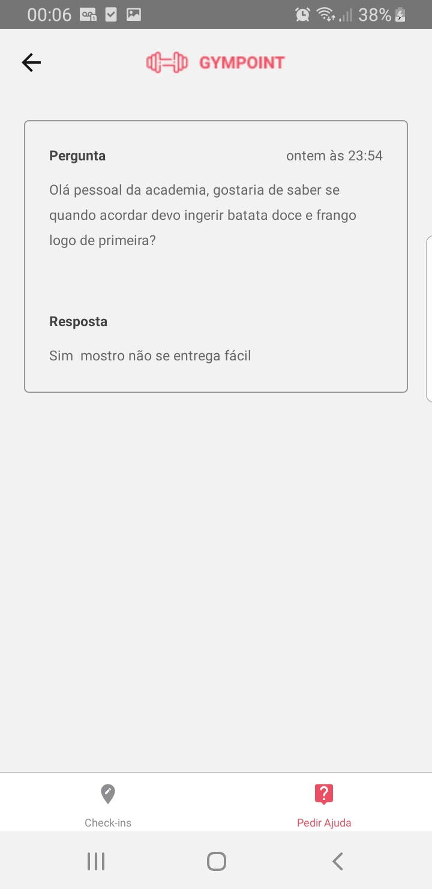

<h1 align="center">
  
</h1>

### Aplicativo para registrar frequencia na academia e pergunta para os instrutores

## Gympoint

Aplicativo para registrar frequencia dos alunos na academia  e fazer perguntas para os instrutores
- Implementado usando React Native

<h1 align="center">
 
Gympoint
</h1>

Aplicativo para registrar a frequencia na academia e pergunta para os instrutores

  

  
  
  

