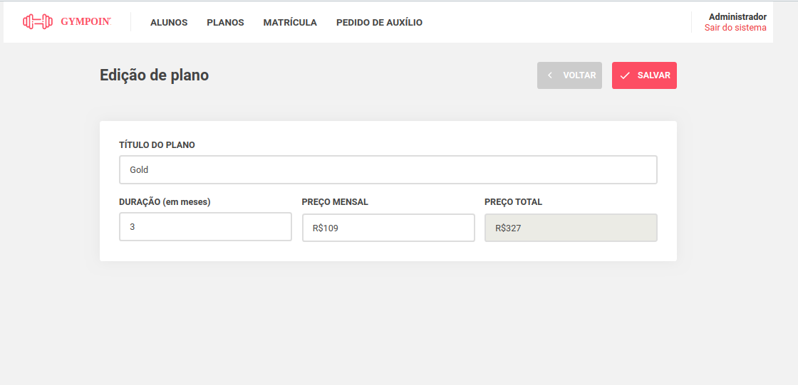

<h1 align="center">
  
</h1>

### Sistema de gerenciamento de alunos e matrículas

## Gympoint

Aplicativo de teste para encontrar/cadastrar/remover desenvolvedores
-Implementado usando ReactJS

<h1 align="center">
 
DevRadar
</h1>

Sistema de gerenciamento de alunos e matrículas

  

  
  

  
  

  
  

  
  

